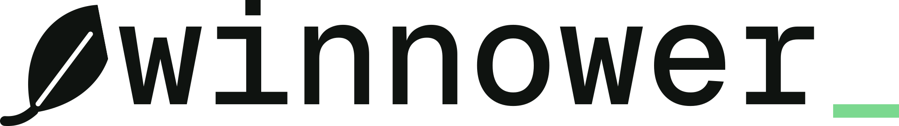

<h1 align="center">
  <picture>
    <source media="(prefers-color-scheme: dark)" srcset="brand/readme/lockup-on-dark.svg">
    
  </picture>
</h1>

<p align="center">
  A free, open-source content blocker for Chrome and other Chromium browsers.<br>
  Every page in its final shape.
</p>

<p align="center">
  <a href="https://winnower.meistyr.tech">Website</a> ·
  <a href="https://github.com/meistyr/winnower-adblock/releases/latest/download/winnower.zip">Download</a> ·
  <a href="CHANGELOG.md">Changelog</a>
</p>

## What it blocks

| | |
|---|---|
| Ads, banners and trackers | About 130,000 network rules from ten community filter lists |
| YouTube ads | Blocks ads on YouTube, including pre-roll and mid-roll |
| Leftover ad boxes | Hides ad containers on the page and collapses the gaps they leave |
| Popups and popunders | Blocks popups and popunders from known ad networks |

From the toolbar you can pause winnower on the site you're on, switch filter lists on and off,
or turn it off everywhere.

Streaming ads that are stitched into the video itself are not blocked.

winnower sends nothing anywhere. The filter lists ship inside the extension, and it only ever
reads its own files.

## Install

1. Download [`winnower.zip`](https://github.com/meistyr/winnower-adblock/releases/latest/download/winnower.zip)
   and unzip it.
2. Open `chrome://extensions` and turn on **Developer mode**.
3. Click **Load unpacked** and select the unzipped folder.

To update, download the latest zip, replace the contents of that folder, and click the reload
button on winnower's card in `chrome://extensions`. Your settings are kept.

## Build from source

Needs Node **22.18 or newer**.

```sh
npm install
npm run update     # type-check, fetch the filter lists, build, validate
npm run package    # optional: build winnower.zip, as published on Releases
```

Then load the `extension/` folder with **Load unpacked**. `extension/` is generated and
gitignored; `npm run update` rebuilds it from scratch.

| Path | Contents |
|---|---|
| `src/` | The extension, in TypeScript, bundled by esbuild |
| `src/shared/` | Code and types the extension and the build share |
| `build/` | The build pipeline, in TypeScript run directly by Node |
| `brand/` | Logo files and toolbar icons (see [`brand/README.md`](brand/README.md)) |

Releases are built by GitHub Actions when a `v*` tag is pushed. See [`CHANGELOG.md`](CHANGELOG.md).

## Licence

Copyright (C) 2026 meistyr.tech. GPL-3.0-or-later, see [LICENSE](LICENSE). winnower comes with
no warranty.

Uses [@adguard/scriptlets](https://github.com/AdguardTeam/Scriptlets) and
[@adguard/dnr-converter](https://github.com/AdguardTeam/tsurlfilter), both GPL-3.0.

The filter lists are not stored in this repository. They are fetched at build time, and a built
extension or release zip contains rules converted from them, so it includes a `CREDITS.txt`
naming each list with the homepage and licence declared in its own header. The lists remain
under their own licences:

| List | Maintainer | Licence |
|---|---|---|
| uBlock filters, Badware risks, Quick fixes, Unbreak, Privacy | [uBlock Origin](https://github.com/uBlockOrigin/uAssets) | [GPL-3.0](https://github.com/uBlockOrigin/uAssets/blob/master/LICENSE) |
| EasyList, EasyPrivacy | [EasyList](https://easylist.to/) | [EasyList licence](https://easylist.to/pages/licence.html) |
| EasyList Cookie List, Fanboy's Annoyance List | [EasyList](https://easylist.to/) | [CC BY 3.0](https://creativecommons.org/licenses/by/3.0/) |
| Ad and tracking server list | [Peter Lowe](https://pgl.yoyo.org/adservers/) | No licence stated; its site welcomes combining it with other lists |

Not affiliated with YouTube or Google.
